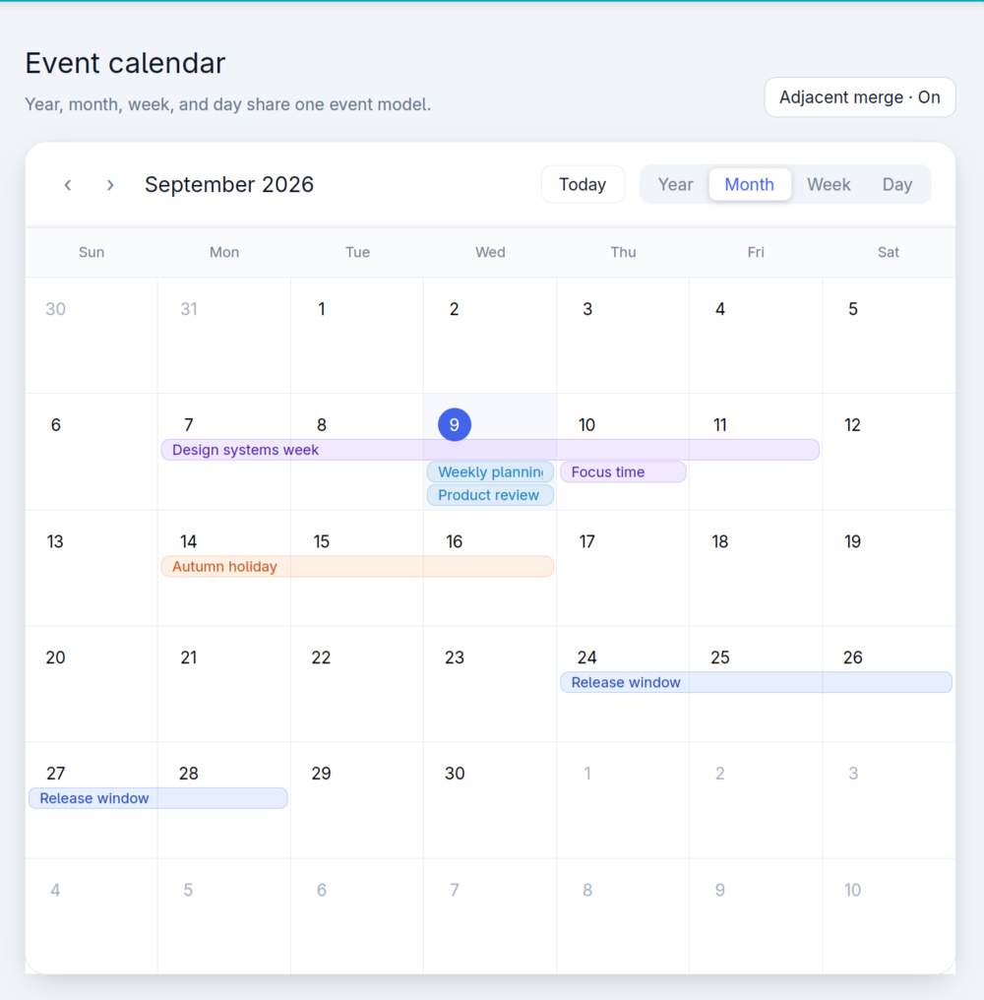
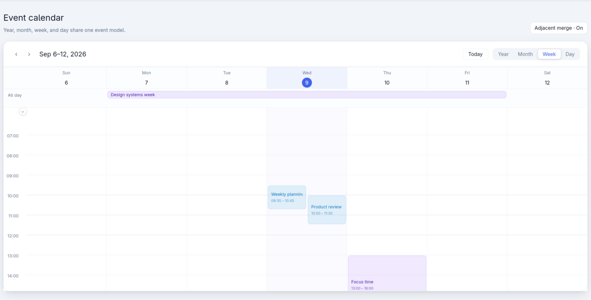
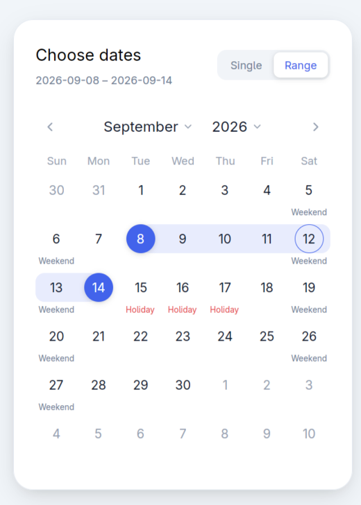

# Calendar

UIC provides a shared calendar state, four independent calendar projections,
small navigation controls, and a compact date picker. Applications choose the
parts they need and own the surrounding toolbar, modal, popover, event editor,
and data loading.



## Component map

| Part | Purpose |
| --- | --- |
| `CalendarState` | Shared date, view, date selection, time selection, expanded time ranges, and selected event |
| `YearCalendar` | Lightweight overview of one year |
| `MonthCalendar` | Month grid with event lanes and multi-day event merging |
| `WeekCalendar` | Seven-day timeline with all-day and timed events |
| `DayCalendar` | Single-day timeline using the same event and time-selection model |
| `CalendarPager` | Previous and next controls |
| `CalendarTitle` | Localized title for the active projection |
| `CalendarTodayButton` | Moves the shared state to today |
| `CalendarViewSwitcher` | Changes the active projection |
| `CalendarDatePicker` | Compact single-date or range picker for forms, popovers, and modals |

The projections do not contain a toolbar. Compose the controls around a
projection, omit them, or replace them with application-specific controls.

## Quick start

Create one state entity and keep a subscription alive so the owner redraws when
the state changes.

```rust,ignore
use std::sync::Arc;

use chrono::NaiveDate;
use gpui::{Context, Entity, Subscription};
use uic::components::calendar::{
    CalendarEvent, CalendarState, CalendarStateEvent, CalendarView,
};

struct Planner {
    calendar: Entity<CalendarState>,
    events: Arc<[CalendarEvent<()>]>,
    _subscription: Subscription,
}

impl Planner {
    fn new(cx: &mut Context<Self>) -> Self {
        let anchor = NaiveDate::from_ymd_opt(2026, 9, 9).unwrap();
        let calendar = cx.new(|_| CalendarState::new(anchor, CalendarView::Month));
        let subscription = cx.subscribe(
            &calendar,
            |_, _, event: &CalendarStateEvent, cx| {
                match event {
                    CalendarStateEvent::SelectionChanged(selection) => {
                        println!("date selection: {selection:?}");
                    }
                    CalendarStateEvent::TimeSelectionsChanged(ranges) => {
                        println!("time selections: {ranges:?}");
                    }
                    _ => {}
                }
                cx.notify();
            },
        );

        Self {
            calendar,
            events: Arc::from([]),
            _subscription: subscription,
        }
    }
}
```

Render the active projection by matching the view stored in the shared state.

```rust,ignore
use gpui::{AnyElement, IntoElement, div, prelude::*};
use uic::components::calendar::{
    CalendarPager, CalendarTitle, CalendarTodayButton, CalendarView,
    CalendarViewSwitcher, DayCalendar, MonthCalendar, WeekCalendar, YearCalendar,
};

let body: AnyElement = match self.calendar.read(cx).view() {
    CalendarView::Year =>
        YearCalendar::new("year", &self.calendar, self.events.clone())
            .flex_1()
            .min_h_0()
            .into_any_element(),
    CalendarView::Month =>
        MonthCalendar::new("month", &self.calendar, self.events.clone())
            .flex_1()
            .min_h_0()
            .into_any_element(),
    CalendarView::Week =>
        WeekCalendar::new("week", &self.calendar, self.events.clone())
            .flex_1()
            .min_h_0()
            .into_any_element(),
    CalendarView::Day =>
        DayCalendar::new("day", &self.calendar, self.events.clone())
            .flex_1()
            .min_h_0()
            .into_any_element(),
};

div()
    .flex()
    .flex_col()
    .child(
        div()
            .flex()
            .items_center()
            .justify_between()
            .child(
                div()
                    .flex()
                    .items_center()
                    .child(CalendarPager::new("pager", &self.calendar))
                    .child(CalendarTitle::new(&self.calendar)),
            )
            .child(
                div()
                    .flex()
                    .items_center()
                    .child(CalendarTodayButton::new("today", &self.calendar))
                    .child(CalendarViewSwitcher::new("views", &self.calendar)),
            ),
    )
    .child(body)
```

Every control is optional. `CalendarPager` and `CalendarTitle` can also be
pinned to a projection with `.view(CalendarView::Week)` instead of following
`CalendarState::view()`.

## Events

`CalendarEvent<T>` stores application data in an `Arc<T>`, allowing the same
event collection to move cheaply between projections.

```rust,ignore
use chrono::{Duration, TimeZone as _, Utc};
use gpui::rgba;
use uic::components::calendar::{CalendarEvent, CalendarEventMerge};

let conference = CalendarEvent::all_day_range(
    "conference",
    "Design conference",
    start_date,
    end_date + Duration::days(1),
    ConferenceId(42),
)
.color(rgba(0x7c3aedff).into());

let review = CalendarEvent::timed(
    "review",
    "Product review",
    Utc.with_ymd_and_hms(2026, 9, 9, 10, 0, 0).single().unwrap(),
    Utc.with_ymd_and_hms(2026, 9, 9, 11, 30, 0).single().unwrap(),
    MeetingId(7),
);
```

All-day ranges use an exclusive end date. Timed events are stored in UTC and
rendered with the projection's `.display_offset(...)`.

### Merging adjacent days

An explicit multi-day event stays visually connected with the default
`CalendarMergePolicy::ExplicitOnly`. Separate adjacent events are joined only
when merging is enabled and they share a key.

```rust,ignore
use uic::components::calendar::{
    CalendarEvent, CalendarEventMerge, CalendarMergePolicy, MonthCalendar,
};

let first = CalendarEvent::all_day("holiday-1", "Holiday", monday, Holiday)
    .merge(CalendarEventMerge::Key("national-holiday".into()));
let second = CalendarEvent::all_day("holiday-2", "Holiday", tuesday, Holiday)
    .merge(CalendarEventMerge::Key("national-holiday".into()));

MonthCalendar::new("month", &calendar, Arc::from([first, second]))
    .merge_policy(CalendarMergePolicy::AdjacentByKey)
```

Available policies are:

| Policy | Behavior |
| --- | --- |
| `None` | Every day is rendered independently |
| `ExplicitOnly` | Explicit multi-day ranges stay connected; separate events remain separate |
| `AdjacentByKey` | Also joins adjacent or overlapping events that share a merge key |

Use `.merge_key(...)` when the key should be derived from application data
instead of stored in `CalendarEventMerge`. Use `.segment_label_policy(...)` to
choose whether a multi-week event is labelled on every segment, the first
segment, or only its longest segment.

## Week and day timelines



The visible grid remains one row per hour. Selection precision controls input
snapping, not grid density.

```rust,ignore
use std::{sync::Arc, time::Duration};
use uic::components::calendar::{
    CalendarClockRange, CalendarTimeSelectionMergePolicy, WeekCalendar,
};

WeekCalendar::new("week", &calendar, events)
    .time_range(0, 24)
    .time_selection_precision_minutes(15)
    .time_selection_max_slots_per_range(Some(8))
    .time_selection_merge_policy(
        CalendarTimeSelectionMergePolicy::SeparateAdjacent,
    )
    .time_selection_long_press_delay(Duration::from_millis(350))
    .collapsed_time_ranges(Arc::from([
        CalendarClockRange::hours(0, 6),
    ]))
```

Interaction behavior:

- A short click toggles one precision-sized slot.
- Clicking inside an existing continuous selection removes that range.
- Long-pressing and dragging previews a continuous range; releasing commits it.
- `time_selection_max_slots_per_range` limits each continuous range, not the
  total number of selected ranges. `None` removes the limit.
- `SeparateAdjacent` keeps independently selected neighboring ranges separate.
  `MergeAdjacent` joins them.
- A collapsed clock range renders as a compact row. Its timeline button expands
  it, and the corresponding button collapses it again.

Committed selections are available through `CalendarState::time_selections()`
and `CalendarStateEvent::TimeSelectionsChanged`.

## Compact date picker

`CalendarDatePicker` owns no modal or popover. Place it directly in a form, or
compose it inside the application's preferred overlay.



```rust,ignore
use std::sync::Arc;

use chrono::{Datelike as _, Weekday};
use gpui::rgb;
use uic::components::calendar::{
    CalendarDatePicker, CalendarSelectionMode, DatePickerDayLabel,
};

let blocked_dates = Arc::new(blocked_dates);
let legal_holidays = Arc::new(legal_holidays);

CalendarDatePicker::new("leave-dates", &calendar)
    .selection_mode(CalendarSelectionMode::Range)
    .first_weekday(Weekday::Mon)
    .min_date(first_allowed_date)
    .max_date(last_allowed_date)
    .date_enabled({
        let blocked_dates = blocked_dates.clone();
        move |date| !blocked_dates.contains(&date)
    })
    .day_label({
        let legal_holidays = legal_holidays.clone();
        move |date| {
            if legal_holidays.contains(&date) {
                Some(DatePickerDayLabel::new("Holiday").color(rgb(0xe5484d).into()))
            } else if matches!(date.weekday(), Weekday::Sat | Weekday::Sun) {
                Some(DatePickerDayLabel::new("Weekend"))
            } else {
                None
            }
        }
    })
```

Single and range selection share `CalendarState::selection()`. Range selection
can cross month boundaries. Clicking an outside-month date selects it without
automatically paging the displayed month.

The month and year parts of the header open dedicated 3 by 4 month and 4 by 4
year panels. Paging changes months, years, or sixteen-year windows depending on
the active panel. The close control returns to the date grid without clearing
the current date selection. Applications can also control the panel through
`CalendarState::set_date_picker_view`.

Use `.show_outside_days(false)` to hide adjacent-month dates. Use
`.day_content(...)` for fully custom cell content while retaining the picker's
selection, range, disabled, hover, and accessibility behavior.

## Custom content

Month, week, and day projections expose managed customization points:

```rust,ignore
use chrono::Datelike as _;
use gpui::{StyleRefinement, div, prelude::*, px, rgb};

MonthCalendar::new("month", &calendar, events)
    .day_content(|day| {
        div()
            .flex()
            .justify_between()
            .child(day.date.day().to_string())
            .child(format!("{} events", day.event_count))
    })
    .event_content(|event| {
        div()
            .min_w_0()
            .truncate()
            .child(event.title.clone())
    })
    .event_style(|event| {
        let color = if event.is_selected { 0xeef2ff } else { 0xffffff };
        StyleRefinement::default()
            .rounded(px(8.))
            .bg(rgb(color))
    })
```

`day_content` replaces only the managed day cell's inner content.
`event_content` replaces only the event's content. `event_style` refines the
managed wrapper, so click handling, event selection, segmentation, and layout
remain owned by the calendar. Year view deliberately uses a compact paint layer
and does not invoke `day_content`.

## Internationalization

The default locale is deterministic English and does not read process-global
locale state. Labels, month names, weekday names, and formatters are all
replaceable.

```rust,ignore
use chrono::{Datelike as _, Weekday};
use uic::components::calendar::{CalendarLocale, CalendarLocaleLabels};

let mut labels = CalendarLocaleLabels::default();
labels.year = "年".into();
labels.month = "月".into();
labels.week = "周".into();
labels.day = "日".into();
labels.today = "今天".into();
labels.all_day = "全天".into();
labels.previous = "上一页".into();
labels.next = "下一页".into();
labels.cancel = "取消".into();

let locale = CalendarLocale::default()
    .labels(labels)
    .first_weekday(Weekday::Mon)
    .month_title(|month| format!("{}年{}月", month.year, month.month).into())
    .day_number(|date| date.day().to_string().into())
    .hour_label(|hour| format!("{hour:02}:00").into());
```

Pass the same locale to the projection and its separate controls so titles,
buttons, accessible names, and timeline labels stay consistent.

## Styling

All projections, controls, and `CalendarDatePicker` implement `Styled`.
Ordinary outer properties use GPUI style methods:

```rust,ignore
MonthCalendar::new("month", &calendar, events)
    .w_full()
    .min_h(px(620.))
    .p_0()
    .rounded(px(18.))
    .border_1()
    .bg(rgb(0xffffff))
    .shadow_lg()
```

Use `CalendarAppearance` for semantic internal states such as the accent,
selected date, today ring, grid line, event colors, current-time line, and time
selection background. Use `DatePickerAppearance` for the compact picker's
selected, range, disabled, muted, and hover states.

## Loading data for the visible range

The state and every projection expose a half-open `DateRange` suitable for a
data query:

```rust,ignore
let range = calendar.read(cx).visible_range(Weekday::Sun);

let month_range = MonthCalendar::new("month", &calendar, events.clone())
    .visible_range(cx);
```

Listen for `AnchorChanged` and `ViewChanged`, query the new visible range, and
replace the `Arc<[CalendarEvent<T>]>` passed to the projection. Event loading,
caching, persistence, editing, and recurrence expansion remain application
responsibilities.

## Example

Run the complete composed example:

```sh
cargo run -p uic --example calendar
```

The compact picker is available separately:

```sh
cargo run -p uic --example date_picker
```
